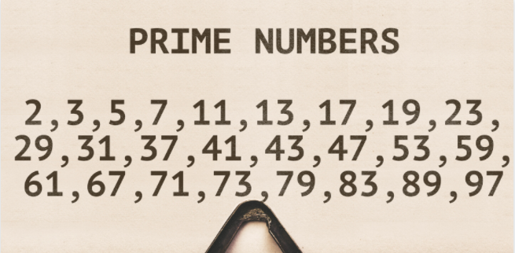
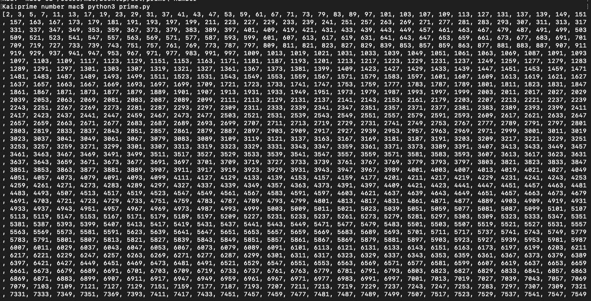
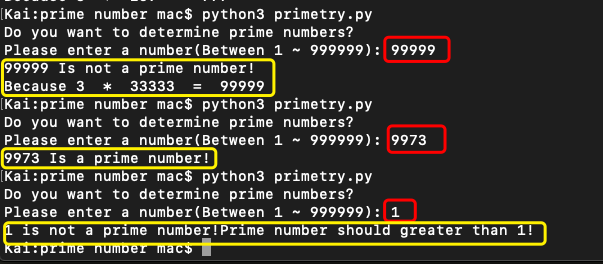

### About this repository

This repository is about prime number,
> **Here are some brief infomation about prime number:**
*In math, prime numbers are whole numbers greater than 1, that have only two factors – 1 and the number itself. Prime numbers are divisible only by the number 1 or itself. For example, 2, 3, 5, 7 and 11 are the first few prime numbers.*
---
- **When you open  "prime.py"**
It can help you to find prime numbers from 2 to 9999. 

- **When you open "primetry.py"**
1. It allowed user enter a number, between 1 ~ 99999
2. After user enter the number, it will determine whether it is a prime number or not.
3. If that number is not a prime number, it will explian why.
 4. If the number <= 1, it will remind: Prime number should greater than 1.

>*That is all about this repository, if you have any question, feel free to contact me.*

### Connect with me:

 